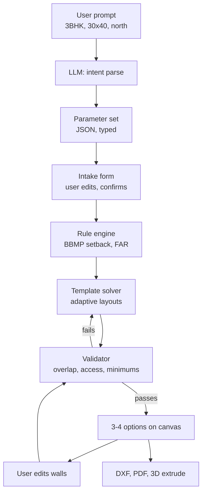

# AI Floor Plan Tool — MVP PRD

2026-09-22 · @amitesh

A browser tool where an architect describes a residential project in plain language and gets three or four scale-accurate, code-checked floor plan options in editable DXF — for ideation and client conversation, not construction documentation. Scoped to Bengaluru plotted residential, with the user's own LLM key.

## Positioning

The tool serves the first two hours of a residential project, when an architect is testing whether a brief fits a plot and needs something to put in front of a client. It replaces hand-sketched option studies, not Revit.

The user is a solo architect or a 2–10 person practice in Bengaluru doing plotted residential work. They already own AutoCAD or SketchUp and will not abandon it. The tool must hand work off to those, cleanly.

What it produces: three to four scale-accurate schematic plans, dimensioned, wall-thickness correct, checked against setback and FAR rules, exportable as layered DXF.

What it is not:

- Not construction documentation. No structural sizing, no MEP, no schedules, no detailing. The architect does the last mile.
- Not a BIM authoring tool. It seeds a model; it does not replace one.
- Not an autonomous designer. It generates options for a human to judge, reject and edit.
- Not a renderer. Visual quality is a later problem.

## MVP scope

One typology, one authority, one output format. Everything below the line is a later release, not a stretch goal.

| Area | In for v1 | Out for v1 |
| --- | --- | --- |
| Typology | Independent plotted residential, G+1 to G+3, single family per floor | Apartments, villas, clinics, retail, parking structures |
| Plot | Rectangular, 20x30 to 60x40 ft, single road frontage | Irregular, sloping, multi-frontage, corner-plot logic |
| Region | BBMP / BDA plotted residential bylaws, one revision, dated | Other cities, other states, industrial or commercial zoning |
| Program | 1–4 BHK, kitchen, living, dining, toilets, balcony, puja, utility | Basements, mezzanines, duplex internal stairs, servant blocks |
| Vertical | Ground floor plus repeating upper floors, staircase in fixed positions | Split levels, double-height voids, ramps |
| Parking | Car and two-wheeler count, footprint reserved on ground | Stack parking, basement parking, turning-circle validation |
| 3D | Straight extrusion of the plan to floor height | Roofs, openings in 3D, materials, shadows, renders |
| Export | Layered DXF, PDF plan sheet | IFC, Revit, SketchUp, Rhino round-trip |
| LLM | Bring-your-own key, allowlisted models, server-side proxy | Fine-tuned in-house model, local model hosting |
| Accounts | Single user, no auth, session-scoped projects | Teams, sharing, permissions, billing |

The hard rule for v1: if a constraint cannot be checked, the feature that depends on it does not ship. A plan that silently violates a setback is worse than no plan.

## How it works

The LLM never emits geometry. It reads intent and fills a parameter set; a deterministic solver turns that parameter set into walls. This split is the load-bearing decision of the whole product.



Three things follow from this shape. Because the LLM only produces typed JSON, a mid-tier model performs nearly as well as a frontier one, which is what makes bring-your-own-key viable. Because the solver is deterministic, the same parameter set always yields the same plan, so an architect can reproduce and trust a result. Because the validator sits between the solver and the screen, no geometrically invalid plan ever reaches the user.

The solver works from a curated template library, not free-form search. Each template is a known-good layout topology for a typology — a 2BHK with central circulation, a 3BHK with a side corridor — which then stretches and adjusts to the actual plot and areas. Templates are far more reliable than solving from scratch, and each new template is a visible product improvement rather than a model retrain.

## Parameter intake model

Every parameter sits in one of three tiers. Ask only tier 1. Compute tier 2 and show the reasoning. Default tier 3 silently and expose it in settings. The goal is six questions on screen, not thirty.

**Tier 1 — must ask.** The plan cannot be generated without these, and none can be guessed.

| Parameter | Format | Note |
| --- | --- | --- |
| Plot dimensions | ft or mm, W x D | Unit toggle is global and sticky |
| Road-facing side | N / S / E / W | Sets entry and setback asymmetry |
| North angle | degrees | Drives orientation and Vaastu if enabled |
| Bedrooms | 1–4 | The headline brief |
| Floors | G, G+1, G+2, G+3 | Changes staircase and FAR maths |
| Car parking | count | Reshapes the entire ground floor |

**Tier 2 — derived, shown with reasoning.** Pre-filled and editable, each with a one-line explanation of where the number came from.

| Parameter | Derived from |
| --- | --- |
| Permissible FAR and built-up area | Plot area x BBMP FAR for the road width |
| Setbacks, all four sides | Plot area band in the bylaw table |
| Ground coverage limit | Plot area band |
| Toilet count | Bedroom count, Indian convention: master attached, rest common |
| Room areas | Bedroom count and available built-up, against Neufert-style minimums |
| Staircase footprint | Floor count and riser and tread standard |
| Overhead tank and sump | Occupancy estimate from bedroom count |

**Tier 3 — defaults in settings.** Never asked on first run. A one-time inline note tells the user where to change them.

| Parameter | Default |
| --- | --- |
| External wall thickness | 230 mm |
| Internal wall thickness | 115 mm |
| Floor-to-floor height | 3000 mm |
| Main door | 1050 x 2100 mm |
| Internal door | 900 x 2100 mm |
| Toilet door | 750 x 2100 mm |
| Kitchen type | Closed, with utility |
| Puja room | Included, 900 x 900 mm niche minimum |
| Balcony | One, off living, 1200 mm depth |
| Two-wheeler parking | Two slots |
| Units | Feet for plot, mm for construction |
| DXF layer scheme | Walls, doors, windows, dimensions, text, furniture, grid |

**Ambiguity prompts.** Where the brief is genuinely underspecified, the tool surfaces a short chip row above the input rather than a modal: *Attached toilets for all bedrooms?* / *Servant room?* / *Lift?* / *Vaastu constraints?* Each chip is one tap, and skipping it accepts the default.

The same three-tier structure carries over to later typologies. A clinic swaps the tier 1 questions for consultation-room count and reception position, and swaps tier 3 for corridor widths and accessibility clearances, but the machinery is unchanged.

## Compliance and constraint layer

Rules live in a versioned JSON ruleset, never in application code. Each rule carries its source clause, the revision date, and the authority. Adding Chennai later means adding a file, not rewriting the solver.

Three classes of constraint, handled differently:

1. **Hard — blocking.** Setbacks, ground coverage, FAR, minimum room dimensions, staircase width and headroom. A plan that violates one is never shown. The solver retries.
2. **Soft — flagged.** Natural light and ventilation per room, circulation efficiency, kitchen and toilet adjacency to shafts. Shown as a warning on the canvas, not blocked. The architect overrides.
3. **Optional — user-enabled.** Vaastu. Off by default. When on, it becomes a set of directional preferences fed to the solver: kitchen toward south-east, master bedroom south-west, puja north-east, main entry per the north angle, toilets away from north-east. It ranks and biases options; it never blocks generation, and its influence is shown so the architect can see what it cost in efficiency.

A live compliance panel sits beside the canvas at all times: FAR used against permitted, ground coverage used against permitted, each setback measured, total built-up per floor. This panel is the single most credible feature in the product — it is the thing that makes an architect believe the plan is real rather than a picture.

Every ruleset ships with a visible as-of date and a plain disclaimer that the output is indicative and must be verified against the sanctioning authority before submission. This is not legal cover alone; architects genuinely need to know which bylaw revision they are looking at.

## UX

Desktop only. A mobile build for this is wasted effort — nobody lays out a plan on a phone.

**First screen.** A single centred input, full width, with four or five example prompts beneath it. No sidebar, no settings, no onboarding tour. The user types one sentence.

**After first input.** The viewport splits: chat on the left at roughly 30 percent, canvas on the right. The intake form renders inline in the chat as a compact card with tier 1 fields visible and tier 2 collapsed behind *Show derived values*. The user confirms and generation starts.

**The canvas** is the product. Four requirements:

- **Options, not an answer.** Three or four layouts as selectable thumbnails along the canvas edge. Selecting one makes it the working plan. This matches how architects actually think, and it lowers the cost of any single bad output.
- **Directly editable.** Drag a wall, resize a room, swap two rooms. Every edit re-runs the validator and updates the compliance panel live. A read-only preview will be abandoned within one session.
- **Violations rendered in place.** Hard failures in red on the offending wall or room, soft warnings in amber, each with a hover explanation. Never a separate error list.
- **Layer toggles.** Walls, dimensions, furniture, grid, text — matching the DXF export layers exactly, so what the architect sees is what opens in AutoCAD.

**Iteration through chat.** Follow-up instructions edit the existing plan rather than regenerating it: *make the master bigger*, *move the kitchen to the back*, *drop the balcony*. Under the hood this is a parameter-set diff plus a re-solve, with the previous version kept.

**Version history.** A simple linear stack of named states with the ability to branch. Architects compare options side by side; losing a version they liked is the fastest way to lose the user.

**Settings.** One panel, reachable but never in the way: units, wall thicknesses, door schedule, default room areas, DXF layer names, LLM provider and key, Vaastu toggle.

## Outputs, metrics and risks

**Outputs.** Layered DXF is the primary deliverable and the thing you will be judged on — an architect opens it in AutoCAD and decides in five seconds whether you are serious. Layers must be named conventionally, walls closed as polylines, dimensions on their own layer, text at a sane scale. A PDF plan sheet with a title block covers client conversations. The 3D extrusion exports as a simple solid, useful for massing only.

**Success metrics.** Three that matter, in order:

| Metric | Target for v1 | Why it matters |
| --- | --- | --- |
| Export rate | 40% of sessions reach a DXF or PDF export | The only real signal the output was usable |
| Edits before export | Median under 8 wall edits | Measures how close first generation lands |
| Compliance pass rate | 100% of shown plans pass hard rules | Trust is binary; one bad plan costs the user |

Vanity metrics to ignore: prompts submitted, plans generated, time in app. A user generating forty plans and exporting none is a failure, not engagement.

**The feedback loop.** Log the parameter set, the chosen option, every manual edit, and whether the session ended in export. That correction data — where the solver put a wall and where the architect moved it — is the compounding asset. It tells you which templates to fix and, eventually, gives you the dataset for a fine-tuned intent parser. Build this logging on day one, not later.

**Risks.**

- **Output looks naive to a trained eye.** The likeliest failure. Mitigation: seed the template library from real, well-resolved plans rather than generating topologies procedurally.
- **Bylaw interpretation is wrong.** Mitigation: get one practising Bengaluru architect to review the ruleset before launch, and date-stamp everything.
- **BYO-LLM produces inconsistent quality.** Mitigation: allowlist, plus an eval set of thirty test briefs run against every supported model.
- **DXF opens badly.** Mitigation: test round-trips in AutoCAD, Revit and SketchUp before shipping anything else.

**Open questions.**

- [ ] Which template library seeds v1, and who draws the first ten layouts?
- [ ] Does the canvas run on SVG or a WebGL CAD kernel? Editability requirements may force the latter sooner than expected.
- [ ] Is there a hosted default LLM for users without a key, and who pays for it?
- [ ] Which BBMP bylaw revision is authoritative as of launch?

## Open-source building blocks

Nothing open-source does the whole job. But most of the plumbing already exists, and the only part worth writing yourself is the template solver, the ruleset and the intake model — which is exactly where the product value sits.

**Build directly on these.**

| Project | What it gives you | License note |
| --- | --- | --- |
| [ezdxf](https://ezdxf.mozman.at/) (mozman/ezdxf) | Python library to create and modify DXF, version-independent, with layer and entity control. This is your export layer. | MIT — commercially safe |
| [dxf-viewer](https://github.com/vagran/dxf-viewer) (vagran) | DXF 2D viewer in JavaScript, Three.js based. Candidate for the canvas render layer. | Check before commercial use |
| [cad-viewer](https://github.com/mlightcad/cad-viewer) (mlightcad) | Browser-based DXF/DWG viewer and editor, no backend, WebGL. Ships a headless `cad-simple-viewer` core plus an optional UI plugin — useful if you want the canvas without their app shell. | Check before commercial use |
| [awesome-cad](https://github.com/mlightcad/awesome-cad) | Curated index of open-source CAD libraries by category — kernels, DXF parsers, viewers, parametric frameworks. Start here when you need a component. | Reference list |
| [IfcOpenShell](https://github.com/PedroRuda/IfcOpenShell) | The IFC library and geometry engine. Only needed when you add BIM export in a later release. | LGPL/GPL — read carefully before bundling |

**Study these, do not depend on them.** Useful as reference implementations for the solver, but research-grade or single-author.

| Project | Relevance |
| --- | --- |
| [RoomRubiks](https://pypi.org/project/roomrubikspack/) (`roomrubikspack`) | The closest match to your problem: procedural floorplan layout via an elitist genetic algorithm, with connectivity checks and DXF export through ezdxf. Written by a practising architect and published in the Journal of Architectural Engineering. Note the heavy layout generation runs on their API server, not locally. |
| [Floor-Plan-Generator-Using-AI](https://github.com/z-aqib/Floor-Plan-Generator-Using-AI) | Constraint-satisfaction approach to layout from room requirements and sizes. Small and student-built, but the CSP framing is the right mental model for your solver. |
| [fml-wright](https://github.com/SebGr/fml-wright) | GAN-based floorplan generation. Instructive mainly as a demonstration of why image-generation approaches produce plans you cannot dimension or edit. |
| [floor-sp](https://github.com/woodfrog/floor-sp) | ICCV 2019 floorplan reconstruction using room-wise shortest path. Relevant if you later add scan-to-plan or drawing import. |
| [MCP4IFC](https://show2instruct.github.io/mcp4ifc/) | LLM-driven BIM through the Model Context Protocol, built on IfcOpenShell and Bonsai, combining a fixed tool library with RAG-backed code generation. The clearest published example of the LLM-calls-tools pattern applied to buildings. |
| [harnessbim](https://github.com/ReverseZoom2151/harnessbim) | A full text-to-BIM runtime with headless IFC authoring, LLM agents, RAG and a verification suite. Worth reading for how it separates generation from checking. |

Nothing found covers Indian bylaws, Vaastu constraints, or BBMP-specific rules. That gap is the thing worth owning.

GitHub's `floorplan` and `floorplan-generator` topic pages are worth watching — the space is active enough that new work appears monthly.

**For the axon native CAD track specifically.** Checked against that PRD's stack choices.

| Project | Relevance to axon | Verdict |
| --- | --- | --- |
| [dxf-rs](https://github.com/ixmilia/dxf-rs) (ixmilia) | Rust crate that reads **and writes** DXF. axon currently imports only; this is the export path, using the same crate family already in the workspace. | Adopt |
| [Truck](https://github.com/ricosjp/truck) (ricosjp) | Rust B-rep kernel with NURBS, built on WebGPU, with `truck-js` for WASM. Modular: `truck-geometry`, `truck-topology`, `truck-modeling`. | Hold in reserve. This is the Rust-native answer to PRD §4.5's "do not add OCCT yet" — if real fillets or NURBS become necessary, evaluate Truck before paying the LGPL C++ FFI cost. |
| [Fornjot](https://github.com/hannobraun/fornjot) (hannobraun) | The other Rust b-rep kernel, and the obvious search result. **No longer in development.** Its own README states the mainline code has not been developed in over a year and it is unsuited for real-world use, and it explicitly prioritises mechanical CAD over architecture. | Do not adopt. Noted so nobody rediscovers it. |
| [cad-viewer](https://github.com/mlightcad/cad-viewer) (mlightcad) | MIT-licensed browser DWG/DXF viewer and editor, fully client-side, DWG via libredwg and DXF via dxf-json. Ships a framework-agnostic `cad-simple-viewer` core. | Study, do not adopt. Its renderers are SVG and three.js, which is an explicit axon anti-pattern (§7 — a JS renderer kills headless parity). Valuable instead as a reference for the DWG question in §8.1, and as a stopgap viewer if axon's renderer slips. |
| [Open-2D-Studio](https://github.com/Impertire/Open-2D-Studio) | Tauri plus React plus dxf-rs, with layers, command line, and DXF round-trip. | Reference architecture for a much lighter build than axon — useful as a sanity check on scope. |
| [meshStep](https://github.com/CNCKitchen/meshStep) | Its README documents that OCCT-based routes statically bundle an LGPL-2.1 kernel with linking obligations that get murky in WASM. | Confirms PRD §4.5's instinct to defer OCCT. Worth citing when that decision is revisited. |

## Integrating into axon

The floor plan tool should live inside axon as a generator crate plus a command family — not as a new tab. A tab implies a second document model and a second canvas, which is precisely what invariants I1 and I2 exist to prevent. Entering through the commit path means the generated plan lands in the same document, on the same canvas, editable by the same tools, exported through the same path.

The reuse is real because the two pipelines share their second half. axon runs DXF → heal → classify → pair walls → profile → extrude → subtract openings → tessellate. Generation runs parameters → template solve → profile → extrude → subtract openings → tessellate. Stages 1–3 exist only to clean up messy human drawings; generated geometry is clean by construction, so they are skipped entirely. Stages 4–7 are used unchanged.

| axon asset | What the floor plan tool does with it |
| --- | --- |
| `solid::` extrude, subtract\_openings, tessellate (§4.5 stages 4–7) | Used verbatim. Generated profiles are cleaner input than any imported DXF. |
| `commit::` single write path (I1) | Generation emits commits. No new mutation path, no side channel. |
| `Plan` plus approval loop (I7) | A generated layout *is* a Plan. Three or four options are three or four plans to choose between. |
| `Provenance` (I4) | Maps onto the intake tiers with no translation. See below. |
| `render::view`, browser and headless (I6) | The canvas, the option thumbnails, and the PDF sheet. Thumbnails render server-side through the headless path. |
| Command registry, generated schemas (I3) | `generate_floor_plan` is one more command. The intake form is its schema, rendered. |
| `query_entities`, `measure`, `describe_region` (§4.7) | The compliance panel is a consumer of these, not new infrastructure. |
| Commit DAG (`parent: CommitId`) | Options are branches from a shared parent. Already structurally supported. |
| Deterministic document hash (M1 test) | "Same parameters produce the same plan" is testable with machinery that already exists. |

**Provenance already solves the intake-tier problem.**

| Intake tier | Provenance | Example |
| --- | --- | --- |
| Tier 1, user-entered | `Measured` | Plot is 30 x 40 ft because the architect typed it |
| Tier 2, derived | `Inferred` | Setback 5 ft — reason: BBMP table, plot area band |
| Tier 3, default | `Assumed` | External wall 230 mm — reason: default, not specified |

The axon PRD calls a 2700 mm wall height with no provenance record the single most dangerous line of code in the project. That is exactly the tier 3 default problem, and axon already refuses to let it happen silently. The compliance panel becomes a provenance view.

**The one real conflict — get this wrong and the tool is unusable.** Bylaw compliance must not run through `commit::validate`. That function rejects documents that are *structurally* invalid: layer cycles, unclosed profiles, openings outside walls. A plan that exceeds FAR is structurally valid, and an architect will sometimes draw it deliberately to show a client what the rule costs. If FAR becomes a commit violation, the document cannot hold that drawing at the exact moment it is most useful. So: a separate `rules` crate emitting `Diagnostic` records attached as components, never `Violation` records that block commits. Hard rules constrain the *generator*; they never constrain the *document*.

**What axon does not have yet.**

- DXF export. Import only today. `dxf-rs` writes as well as reads, so this is the same crate on the way out.
- A directly manipulable canvas. M0–M7 render but do not edit by mouse. Dragging a wall is new work and it is not small.
- A `ParameterSet` document component. Parameters must live in Rust, not React state (I2), or regeneration is not a commit and history breaks.
- A template library and a layout solver.
- The `rules` crate and the `Diagnostic` type.

**Sequencing insight worth acting on.** Generation is an easier first exercise of the extrude pipeline than DXF import. Clean synthetic profiles test stages 4–7 without the healing and classification failure modes of real drawings. If axon has not passed M4, building the generator first de-risks it rather than delaying it.

## Phased build plan

One sequence, two tracks. **P** phases are platform work inside axon; **F** phases are floor plan capability. Each phase is small enough to review in one sitting and ends in something demonstrable.

| Phase | Track | Deliverable | Depends on | Done when |
| --- | --- | --- | --- | --- |
| P0 | Platform | Reality audit: which milestone axon actually reached, `ARCHITECTURE.md` describing what exists rather than what was planned | — | Every invariant I1–I8 is labelled structurally enforced, test-enforced, or merely conventional |
| P1 | Platform | `rules` crate skeleton, `Diagnostic` type, attached as a component. Explicitly separate from `commit::validate` | P0 | A document can hold a FAR-violating plan, and the diagnostic is queryable |
| P2 | Platform | `ParameterSet` as a document component, versioned by commits | P1 | Changing a parameter is a commit; history replays to the same hash |
| F1 | Floor plan | `gen` crate with exactly one hardcoded 2BHK template: parameters → closed profiles → `Plan` → commits | P2, axon M4 | A fixed parameter set produces a rendered, dimensioned plan through the normal commit path, with no side-channel mutation |
| F2 | Floor plan | Tier 1 and tier 2 intake with provenance on every value | F1 | Each generated dimension traces to `Measured`, `Inferred` or `Assumed` with a reason string |
| P3 | Platform | DXF export via `dxf-rs`, with the layer scheme from tier 3 defaults | axon M2 | Exported DXF opens clean in AutoCAD with correct layers and closed wall polylines |
| F3 | Floor plan | BBMP ruleset as versioned data; compliance panel reading diagnostics and provenance | P1, F2 | FAR, ground coverage and all four setbacks display live and update on edit |
| F4 | Floor plan | Template library expanded to 3BHK and 4BHK; solver adapts templates to plot and areas | F3 | Ten fixture parameter sets generate valid plans; failures are explicit, not silent |
| F5 | Floor plan | Options as commit branches, three to four per generation, thumbnails via the headless renderer | F4 | Architect picks between branches; switching is instant and lossless |
| F6 | Floor plan | LLM intake: prompt → `ParameterSet`. BYO key through a server-side proxy, allowlisted models | F2 | Thirty test briefs parse correctly across at least two providers |
| P4 | Platform | Direct canvas manipulation: drag a wall, resize a room, each emitting a commit | axon M3, F1 | Every mouse edit is a commit; undo and history work identically for human and agent edits |
| F7 | Floor plan | Vaastu as an optional constraint layer biasing template selection and room placement | F4 | Toggling it changes ranking, never blocks generation, and the cost is visible |
| P5 | Platform | PDF plan sheet with title block, via the headless render path | P3 | A sheet prints at correct scale with dimensions legible |
| F8 | Floor plan | 3D extrusion exposed to the user; correction logging for every manual edit after generation | F5, P4 | Parameter set, chosen branch, every edit and whether the session exported are all logged |

**Critical path to something an architect can use:** P0 → P1 → P2 → F1 → F2 → P3 → F3. That sequence ends with a generated, compliance-checked plan exporting to DXF. Everything after it is breadth.

**Do not start F1 before P2.** If parameters live in React state rather than as a document component, regeneration is not a commit, history breaks, and I2 is violated in a way that is painful to unwind later.

**Open question that changes the plan.** Which milestone did the existing axon build actually reach? If M4 is not complete, F1 should be built *before* import hardening, using generation as the clean-input test of the extrude pipeline. If M4 is complete, F1 slots in directly.

## Claude Code prompt sequence

Same convention as the axon PRD §6: paste one at a time, review the diff before continuing, do not batch. These assume the axon repo and its `CLAUDE.md`.

**Prompt A — P0, orientation and audit**

```
Read PRD-AGENT-NATIVE-CAD.md and CLAUDE.md in full. Write no feature code.

1. Audit the codebase against invariants I1-I8. For each, state whether it is
   enforced structurally, enforced by test, or merely conventional. Anything
   merely conventional is a finding.
2. State which milestone M0-M7 is actually complete, with evidence, not
   intention.
3. Write ARCHITECTURE.md describing what exists, not what was planned.
4. We are adding a floor plan generator that produces geometry from parameters
   instead of importing it from DXF. Tell me where in the current code that
   would be hardest to add without breaking an invariant. Be blunt.

Then stop.
```

**Prompt B — P1 and P2, the seam**

```
P1 and P2. Two new pieces, no generation logic yet.

P1 - a `rules` crate. It produces Diagnostic records: a rule id, a severity
(Hard | Soft | Advisory), a human-readable message, and the entity ids involved.
Diagnostics attach to the document as components.

CRITICAL: rules are NOT commit validation. commit::validate rejects structurally
invalid documents. A plan that exceeds FAR is structurally VALID - an architect
may draw it deliberately to show a client what the bylaw costs. If a bylaw
failure can block a commit, the design is wrong. Hard rules constrain the
generator; they never constrain the document.

Rules are data, loaded from a versioned ruleset file with an authority name and
an effective date. No bylaw numbers hardcoded in Rust. This is the same
principle as the layer classifier in PRD 4.6.

P2 - a ParameterSet component on the document. Every field carries Provenance
per I4. Changing a parameter is a commit, not React state (I2).

Tests: a document holds a FAR-violating plan and the diagnostic is queryable; a
parameter change round-trips through commit and replays to the same hash.

Done when both pass on native and wasm32.
```

**Prompt C — F1, first generated plan**

```
F1. A `gen` crate: parameters in, commits out. ONE hardcoded 2BHK template only -
resist generalising.

Pipeline: ParameterSet -> template instantiation -> closed 2D wall profiles ->
Plan -> commits. Then hand off to the existing solid:: stages 4-7 from PRD 4.5
(profile, extrude, subtract_openings, tessellate). Do NOT write new extrusion
code - if the existing stages cannot consume generated profiles, that is a bug
in the handoff, not a reason to fork the pipeline.

Skip stages 1-3 entirely. Heal, classify and pair_walls exist to clean up messy
human drawings. Generated geometry is clean by construction. If you find
yourself calling heal() on generated output, stop and tell me why.

I1 applies with full force: generation goes through commit::validate like
everything else. This is the second place after import where bypassing it is
most tempting.

I7 applies: generation emits a Plan for approval, then commits.

Every dimension gets Provenance. User-entered is Measured. Derived from a rule
is Inferred, with the rule id in the reason string. A default is Assumed, with
the default value named.

Done when: a fixed parameter set produces a dimensioned plan rendered in
PlanView2d, generated entirely through commits, with a test asserting the count
of Assumed values is non-zero and none are silently Measured.
```

**Prompt D — P3, DXF export**

```
P3. DXF export using dxf-rs (ixmilia/dxf-rs) - the same crate family already
used for import, which writes as well as reads. Check the current version on
crates.io, do not use a version from memory, and add it to VERSIONS.md.

Layer scheme comes from the ParameterSet tier 3 defaults, not from constants:
walls, doors, windows, dimensions, text, furniture, grid.

This is the output an architect judges us on in five seconds. Requirements:
walls as closed polylines, dimensions on their own layer, text at correct scale,
units written explicitly to $INSUNITS.

Required test: export a generated plan, re-import it through the existing
import-dxf path, and assert the wall centrelines and thicknesses match within
tolerance. A round-trip that loses geometry is a failure.

Done when the round-trip test is green and the fixture opens correctly in a DXF
viewer.
```

**Prompt E — F3, compliance panel**

```
F3. The BBMP ruleset and the compliance panel.

Ruleset as versioned data per P1: FAR by road width, setbacks by plot area band,
ground coverage limits, minimum room dimensions, staircase width and headroom.
Each rule carries its source clause, authority, and effective date. Get these
reviewed by a practising architect before trusting them - flag in the PR that
this has not happened yet.

The panel reads diagnostics and provenance. It is a view over existing data, not
new infrastructure. It shows: FAR used against permitted, ground coverage used
against permitted, each setback measured, built-up area per floor. Every number
shows its provenance on hover.

Hard failures render on the offending geometry in the canvas, not in a separate
error list. Soft failures render amber.

Ship with a visible as-of date and the line that output is indicative and must
be verified with the sanctioning authority.

Done when the panel updates live as walls are edited and every displayed number
is traceable.
```
